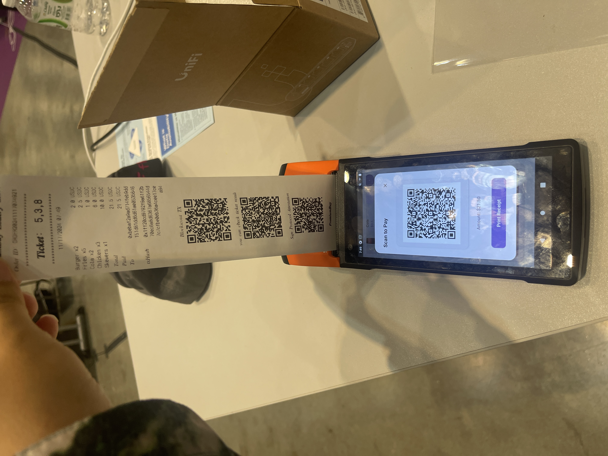

## PremiumBuy Android APP

#### 

#### Contract: https://github.com/yangyaczz/RandomCashBack
#### Frontend: https://github.com/LLHOYH/PremiumBuy
#### Backend: https://github.com/yangyaczz/BCBBackend/tree/main

### Install:
```
Use Android Studio
```

Usage:

- select the item what you want
- use your mobile wallet to scan QR code payment
- machine will automatically print the receipt
- user can scan the QR code on the receipt to view consumption records/merchant activities/consumption chain verification

